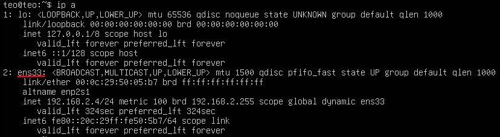

# Configurer le DHCP sur Ubuntu Server LTS 23

Un serveur DHCP (Dynamic Host Control Protocol) permet de donner une ip a tout les hotes du réseau.

## Intalation et configuration du DHCP

Commande pour télécharger le serveur DHCP :

```bash
sudo apt install isc-dhcp-server
```

faite un `ip a` pour relever l'interface que vous utiliser



Dans mon cas c'est `ens33`

On va reigneseigner l'interface dans le fichier `isc-dhcp-server` :

```bash
sudo nano /etc/default/isc-dhcp-server
```

Le fichier suivant va s'ouvrir :

```bash
# Defaults for isc-dhcp-server (sourced by /etc/init.d/isc-dhcp-server)

# Path to dhcpd's config file (default: /etc/dhcp/dhcpd.conf).
#DHCPDv4_CONF=/etc/dhcp/dhcpd.conf
#DHCPDv6_CONF=/etc/dhcp/dhcpd6.conf

# Path to dhcpd's PID file (default: /var/run/dhcpd.pid).
#DHCPDv4_PID=/var/run/dhcpd.pid
#DHCPDv6_PID=/var/run/dhcpd6.pid

# Additional options to start dhcpd with.
#	Don't use options -cf or -pf here; use DHCPD_CONF/ DHCPD_PID instead
#OPTIONS=""

# On what interfaces should the DHCP server (dhcpd) serve DHCP requests?
#	Separate multiple interfaces with spaces, e.g. "eth0 eth1".
INTERFACESv4="ens33"
INTERFACESv6=""
```

On va maintenant modifier le fichier de configuration du DHCP :

```bash
nano /etc/dhcp/dhcpd.conf
```

Ispirer vous de ma configuration pour faire la votre :

```bash
# dhcpd.conf
#
# Sample configuration file for ISC dhcpd
#
# Attention: If /etc/ltsp/dhcpd.conf exists, that will be used as
# configuration file instead of this file.
#

# option definitions common to all supported networks...
option domain-name "teogojkovic.fr";
option domain-name-servers 192.168.2.1, 1.1.1.1;

default-lease-time 600;
max-lease-time 7200;

# The ddns-updates-style parameter controls whether or not the server will
# attempt to do a DNS update when a lease is confirmed. We default to the
# behavior of the version 2 packages ('none', since DHCP v2 didn't
# have support for DDNS.)
ddns-update-style none;

# If this DHCP server is the official DHCP server for the local
# network, the authoritative directive should be uncommented.
#authoritative;

# Use this to send dhcp log messages to a different log file (you also
# have to hack syslog.conf to complete the redirection).
#log-facility local7;

# No service will be given on this subnet, but declaring it helps the
# DHCP server to understand the network topology.

subnet 192.168.2.0 netmask 255.255.255.0 {
}

# This is a very basic subnet declaration.

subnet 192.168.2.0 netmask 255.255.255.0 {
  range 192.168.2.2 192.168.2.200;
  option routers 192.168.2.1;
}
```

Apèss avoir modifier tout cela il faut mettre une IP statique pour notre serveur et pour cela on va se rentre dans le fichier `00-installer-config.yaml` :

```bash
nano /etc/netplan/00-installer-config.yaml
```

Utiliser votre interface et désacriver bien le DHCP avec le `false` :

```bash
# This is the network config written by 'subiquity'
network:
  ethernets:
    ens33:
      dhcp4: false
      addresses:
        - 192.168.2.1/24
  version: 2
  ```